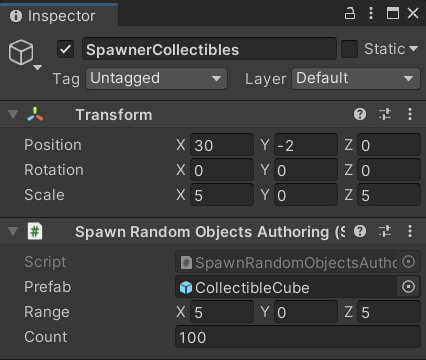
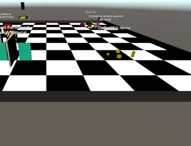

# Prototype Documentation (ENG)

The prototype consists of a small multiplayer videogame in which each player controls their capsule character,
moving it inside the map and interacting with many scene objects. It was made entirely with the packages
provided by DOTS.
<br/>
<p align="center">
	<a href="./Documentazione%20Prototipo.md">Italiano</a>
	·
	<a href="https://github.com/mikyll/UnityDOTS-Thesis">Home page</a>
</p>

<!-- TABLE OF CONTENTS -->
<details open="open">
	<summary><h2 style="display: inline-block">Index</h2></summary>
	<ol>
		<li><a href="#prototype-goal">Prototype Goal</a></li>
		<li><a href="#main-features">Main Features</a></li>
		<li><a href="#standalone-build">Standalone Build</a></li>
		<li><a href="#execution-flow">Execution Flow</a></li>
		<li><a href="#code">Code</a>
			<ul>
				<li><a href="#connections">Connections</a></li>
				<li><a href="#input">Input</a></li>
				<li><a href="#movement">Movement</a></li>
				<li><a href="#third-person-camera-view">Third Person Camera View</a></li>
				<li><a href="#color-change-portals">Color-Change Portals</a></li>
				<li><a href="#teleports">Teleports</a></li>
				<li><a href="#entity-spawn">Entity Spawn</a></li>
				<li><a href="#entity-pick-up">Entity Pick Up</a></li>
			</ul>
		</li>
		<li><a href="#references">References</a>
			<ul>
				<li><a href="#documentation">Documentation</a></li>
				<li><a href="#github-repositories">GitHub Repositories</a></li>
				<li><a href="#dots-forum">DOTS Forum</a></li>
			</ul>
		</li>
	</ol>
</details>

## Prototype Goal

The goal of the prototype is to create a basic gameplay, implementing characters movement and smallinteractions with the game environment, using the packages provided by Unity DOTS architecture.
In particular, the following packages were used:
* Entities, to realize the model based on Entities, Components and Systems (ECS).
* NetCode, to implement the networking side, that is the connections of the players (clients) to the game server and the communication between them.
* Physics, to realize the mechanics related to physics (static/dynamic entities, collision system, etc.).


## Main Features

<table>
	<tr>
		<td align="center"><b>Feature</b></td>
		<td align="center"><b>File</b></td>
		<td align="center" width="40%"><b>Demo</b></td>
	</tr>
	<tr>
		<td>Input stacking and capsule player movement</td>
		<td><a href="/DOTS%20Prototype/Assets/Scripts/Components/PlayerMovementSpeed.cs">PlayerMovementSpeed</a><br/>
		<a href="/DOTS%20Prototype/Assets/Scripts/Systems/PlayerInputSystem.cs">PlayerInputSystem.cs</a><br/>
		<a href="/DOTS%20Prototype/Assets/Scripts/Systems/PlayerMovementSystem.cs">PlayerMovementSystem.cs</a></td>
		<td></td>
	</tr>
	<tr>
		<td>Third person camera follow</td>
		<td><a href="/DOTS%20Prototype/Assets/Scripts/Components/PlayerCameraFollowComponent.cs">PlayerCameraFollowComponent.cs</a><br/>
			<a href="/DOTS%20Prototype/Assets/Scripts/Systems/CameraFollowSystem.cs">CameraFollowSystem.cs</a></td>
		<td></td>
	</tr>
	<tr>
		<td>Color change portals</td>
		<td><a href="/DOTS%20Prototype/Assets/Scripts/Components/PersistentChangeMaterialOnTriggerComponent.cs">PersistentChangeMaterialOnTriggerComponent.cs</a><br/>
		<a href="/DOTS%20Prototype/Assets/Scripts/Systems/PersistentChangeMaterialOnTriggerSystem.cs">PersistentChangeMaterialOnTriggerSystem.cs</a><br/><br/>
		<a href="/DOTS%20Prototype/Assets/Scripts/Components/TemporaryChangeMaterialOnTriggerComponent.cs">TemporaryChangeMaterialOnTriggerComponent.cs</a><br/>
		<a href="/DOTS%20Prototype/Assets/Scripts/Systems/TemporaryChangeMaterialOnTriggerSystem.cs">TemporaryChangeMaterialOnTriggerSystem.cs</a></td>
		<td></td>
	</tr>
	<tr>
		<td>Teleports</td>
		<td><a href="/DOTS%20Prototype/Assets/Scripts/Components/TeleportComponent.cs">TeleportComponent.cs</a><br/>
		<a href="/DOTS%20Prototype/Assets/Scripts/Systems/TeleportSystem.cs">TeleportSystem.cs</a></td>
		<td></td>
	</tr>
	<tr>
		<td>Entities spawn at random points in a volume</td>
		<td><a href="/DOTS%20Prototype/Assets/Scripts/Components/SpawnRandomObjectsAuthoring.cs">SpawnRandomObjectsAuthoring.cs</a></td>
		<td>
			
			
		</td>
	</tr>
	<tr>
		<td>Collectibles pick up</td>
		<td><a href="/DOTS%20Prototype/Assets/Scripts/Components/PlayerScoreComponent.cs">PlayerScoreComponent</a><br/>
		<a href="/DOTS%20Prototype/Assets/Scripts/Components/PickUpSystem.cs">CollectibleTagComponent.cs</a><br/>
		<a href="/DOTS%20Prototype/Assets/Scripts/Components/DeleteTagComponent.cs">DeleteTagComponent.cs</a><br/>
		<a href="/DOTS%20Prototype/Assets/Scripts/Systems/PickUpSystem.cs">PickUpSystem.cs</a><br/>
		<a href="/DOTS%20Prototype/Assets/Scripts/Systems/DeleteCollectibleSystem.cs">DeleteCollectibleSystem.cs</a></td>
		<td width="40%"></td>
	</tr>
</table>


## Standalone Build

To make the <a href="https://docs.unity3d.com/Packages/com.unity.entities@0.17/manual/install_setup.html#standalone-builds">standalone build</a> of an application created using DOTS, it is necessary to use the Platforms packages (com.unity.platforms.\*). In particular, in the case of a <a href="https://docs.unity3d.com/Packages/com.unity.netcode@0.6/manual/client-server-worlds.html#standalone-builds">multiplayer application</a>, NetCode uses the Server Build property in Build Settings and the scripting define symbols in **Project Settings** > **Player** to decide what type of application to build (client only, server only or chosen at runtime).

### Example on Windows
1. Check that com.unity.platforms.windows is installed in the PackageManager.
2. Create a Build Configuration: **Project Window** > **Create** > **Build** > **Windows Classic Build Configuration**.
3. Select the configuration and run the build.
<p float="left">


</p>

## Execution Flow

The prototype execution flow is the following:
1. When the application starts, the Game system (contained in Game.cs file) runs. This system implements the connection of the clients to the server, differentiating the execution of the server, which listens for connections, from the execution of the clients, which connect to the server.
2. Clients execute the code of GoInGameClientSystem, that sends a request to the server to enter the game
and then starts sending commands and receiving snapshots (i.e. game state updates).
3. The server executes the code of GoInGameServerSystem, that receives requests to enter the game and for each player enables communication via commands and snapshots, and generates a capsule character.
4. The application, through the system PlayerInputSystems, continuously checks if the player enters keyboard inputs, and if so store them in a buffer and sends them to the server.
5. The PlayerMovementSystem applies the inputs to the various capsules, using the client-side prediction to make the execution more fluid and to make the network latency perception as little as possibile.
6. In the meantime, the others systems that implement the various features are also getting updated.

## Code

NB: the code snippets shown in this section have been cut out to highlight the key parts explained in the text.

TO-DO Translate Italian doc [...]

### Connections
<details>
File <a href="https://github.com/mikyll/UnityDOTS-Thesis/blob/main/DOTS%20Prototype/Assets/Scripts/Game.cs">Game.cs</a> contains the <i>logic to make the connection</i>. In particular, the system <b>Game</b> checks wheter if we are in a client or a server, calling a connect or listen respectively. <br/>
Once the client and the server are connected, we need to tell NetCode that the clients are ready to send commands and receive snapshots from the server: on the client side, as soon as the connection is established, the system <b>GoInGameSystem</b> starts running and sends a RPC to the server; on the server side, the system <b>GoInGameServerSystem</b>, which started running, receives the RPC and marks the client as "in game", adding the component <b>NetworkStreamInGame</b> to the entity representing the connection and creating a capsule player for the user corresponding to that client.

#### `EnableGame` Component

We declare the <b>EnableGame</b> structure which we will need later to indicate that the clients or the server are ready to connect and enter the game.

#### `Game` System

[UpdateInWorld(UpdateInWorld.TargetWorld.Default)] indicates that the Game system must run in the default world, as this world is always present because it is automatically instantiated by Unity.

Since the Game system code carries out the connection, it only needs to be executed once per application run. Therefore, we use the additional singleton <b>InitGameComponent</b>, to indicate when the code of the system has already been executed once: in the OnCreate() we use the method <b>RequireSingletonForUpdate<>()</b> to state the entity that must be present for OnUpdate() to be called; then we create the entity having this component; finally in OnUpdate() we remove that entity, so the application no longer calls OnUpdate() of the Game system.
```csharp
protected override void OnCreate()
{
	RequireSingletonForUpdate<InitGameComponent>();
	EntityManager.CreateEntity(typeof(InitGameComponent));
}
```

The OnUpdate() method loops over all teh worlds present in the application and, after obtaining the system <b>NetworkStreamReceiveSystem</b> (which exposes the Connect and Listen methods), we check if we are in a client or a server:
* if the application is a client, the ClientWorld will be present, inside which there will be a system group called <b>ClientSimulationSystemGroup</b>. Accordingly, we create the singleton entity <b>EnableGame</b> and we connect to localhost:7979.
* Otherwise, if the application is a server, there will be the ServerWorld, inside which there will be <b>ServerSimulationSystemGroup</b>. Therefore we create the singleton entity <b>EnableGame</b> and we listen on port 7979.
```csharp
protected override void OnUpdate()
{
    EntityManager.DestroyEntity(GetSingletonEntity<InitGameComponent>());
    foreach (var world in World.All)
    {
        var network = world.GetExistingSystem<NetworkStreamReceiveSystem>();
        if (world.GetExistingSystem<ClientSimulationSystemGroup>() != null)
        {
            world.EntityManager.CreateEntity(typeof(EnableGame));
            NetworkEndPoint ep = NetworkEndPoint.LoopbackIpv4;
            ep.Port = 7979;
            ep = NetworkEndPoint.Parse(ClientServerBootstrap.RequestedAutoConnect, 7979);

            network.Connect(ep);
        }
        else if (world.GetExistingSystem<ServerSimulationSystemGroup>() != null)
        {
            world.EntityManager.CreateEntity(typeof(EnableGame));
            NetworkEndPoint ep = NetworkEndPoint.AnyIpv4;
            ep.Port = 7979;

            network.Listen(ep);
        }
    }
}
```

#### `GoInGameRequest` Component
Since the component <b>NetworkStreamInGame</b> has not been added to the entity representing the connection between a client and the server, they cannot communicate by sending commands or snapshots yet. So, we use a NetCode RPC (IRpcCommand) to notify the server that the client is ready to enter the game, so the server can mark the connection and start the communication.<br/>
As explained in the <a href="https://docs.unity3d.com/Packages/com.unity.netcode@0.6/manual/rpcs.html">NetCode docs</a>, to send an RPC we need to create an entity and add the RPC command just created and then the component SendRpcCommandRequestComponent, which triggers the Unity RPC sending system.

#### `GoInGameClientSystem` System
The [UpdateInGroup(typeof(ClientSimulationSystemGroup))] attribute indicates that this system must be updated only on clients, within the ClientSimulationSystemGroup.<br/>
We want this system to run only once, when the client wants to enter the game, specifically between the connection with the server and before the communication via commands and snapshots is started. Therefore, we require that the EnableGame singleton is present and that the entity representing the connection (which has the <b>NetworkIdComponent</b>), does not have the <b>NetworkStreamInGame</b> component.
```csharp
protected override void OnCreate()
{
    RequireSingletonForUpdate<EnableGame>();
    RequireForUpdate(GetEntityQuery(ComponentType.ReadOnly<NetworkIdComponent>(), ComponentType.Exclude<NetworkStreamInGame>()));
}
```

After that, in OnUpdate(), we iterate over all the entities that have <b>NetworkIdComponent</b> but do not have <b>NetworkStreamInGame</b>, which is the entity of the connection. Therefore, using a command buffer, we follow the procedure to send the RPC: we create an entity, we add the RPC command to it, and finally we add the <b>SendRpcCommandRequestComponent</b>, by indicating the target connection.
```csharp
protected override void OnUpdate()
{
    var commandBuffer = new EntityCommandBuffer(Allocator.Temp);
    Entities.WithNone<NetworkStreamInGame>().ForEach((Entity ent, in NetworkIdComponent id) =>
    {
        commandBuffer.AddComponent<NetworkStreamInGame>(ent);
        var req = commandBuffer.CreateEntity();
        commandBuffer.AddComponent<GoInGameRequest>(req);
        commandBuffer.AddComponent(req, new SendRpcCommandRequestComponent { TargetConnection = ent });
    }).Run();
    commandBuffer.Playback(EntityManager);
    commandBuffer.Dispose();
}
```

#### `GoInGameServerSystem` System
The [UpdateInGroup(typeof(ServerSimulationSystemGroup))] attribute indicates that this system must be updated only on the server.
We want this system to run only when, after the EnableGame singleton has been added, it arrives an RPC request from a client. Therefore, we require EnableGame to be present and that there is an entity having as components our RPC command and <b>ReceiveRpcCommandRequestComponent</b>.
```csharp
protected override void OnCreate()
{
    RequireSingletonForUpdate<EnableGame>();
    RequireForUpdate(GetEntityQuery(ComponentType.ReadOnly<GoInGameRequest>(), ComponentType.ReadOnly<ReceiveRpcCommandRequestComponent>()));
}
```

In the OnUpdate() method, we get the list of ghost prefabs, which are the networked objects. In our prototype the only ghost is the PlayerCapsule, which is the character that each player controls and moves around the map. Since this list could be extended in the future, we check anyway if the ghost is the capsule one (i.e. if it has the PlayerMovementSpeed component), and we save it in a variable.<br/>
Then we get the list of the connections <b>NetworkIdComponent</b>, we save it in networkIdFromEntity, which is a <i>dictionary-like</i> container. Through this container we can assign the respective id of the connection to the <b>GhostOwnerComponent</b> of each client's ghost. This fundamental operation must be done "at runtime", since it is not possible to know before who will belong to a certain ghost.<br/>
Then we iterate over all the entities that correspond to RPC requests (thus having GoInGameRequest e ReceiveRpcCommandRequestComponent). Since the request contains the entity of the source connection from which the RPC has been sent, we can use it to add the <b>NetworkStreamInGame</b> component to that entity, and start the communication via commands and snapshots. Once this is done, we instantiate the player capsule and update the NetworkId of that ghost's owner.<br/>
Finally we add to the capsule entity the buffer on which the player's inputs will be stored, and to the connection the <b>CommandTargetComponent</b>, which will be used by the input management system to understand which ghost to apply the inputs received from the player. Furthermore, we destroy the RPC request entity, otherwise the system would keep running forever.<br/>
Now everything is set up to allow the client to sample inputs and send them to the server as commands, and for the server to receive these commands, apply them in its simulation and send snapshots (i.e. game state updates) back to the client.
```csharp
protected override void OnUpdate()
{
    var ghostCollection = GetSingletonEntity<GhostPrefabCollectionComponent>();
    var prefab = Entity.Null;
    var prefabs = EntityManager.GetBuffer<GhostPrefabBuffer>(ghostCollection);
    for (int ghostId = 0; ghostId < prefabs.Length; ++ghostId)
    {
        if (EntityManager.HasComponent<PlayerMovementSpeed>(prefabs[ghostId].Value))
            prefab = prefabs[ghostId].Value;
    }

    var commandBuffer = new EntityCommandBuffer(Allocator.Temp);
    var networkIdFromEntity = GetComponentDataFromEntity<NetworkIdComponent>(true);
    Entities.WithReadOnly(networkIdFromEntity).ForEach((Entity reqEnt, in GoInGameRequest req, in ReceiveRpcCommandRequestComponent reqSrc) =>
    {
        commandBuffer.AddComponent<NetworkStreamInGame>(reqSrc.SourceConnection);
        UnityEngine.Debug.Log(String.Format("Server setting connection {0} to in game", networkIdFromEntity[reqSrc.SourceConnection].Value));

        var player = commandBuffer.Instantiate(prefab); // spawn capsula per il giocatore
        commandBuffer.SetComponent(player, new GhostOwnerComponent { NetworkId = networkIdFromEntity[reqSrc.SourceConnection].Value });

        commandBuffer.AddBuffer<PlayerInput>(player);
        commandBuffer.SetComponent(reqSrc.SourceConnection, new CommandTargetComponent { targetEntity = player });

        commandBuffer.DestroyEntity(reqEnt);
    }).Run();
    commandBuffer.Playback(EntityManager);
    commandBuffer.Dispose();
}
```
</details>

### Input
<details>
The file <a href="https://github.com/mikyll/UnityDOTS-Thesis/blob/main/DOTS%20Prototype/Assets/Scripts/Systems/PlayerMovementSystem.cs">PlayerInputSystem.cs</a> contains the logic for the player input sampling. Since this is a multiplayer game, it's not enough to simply sample the input and use it directly, but it's necessary to store it somewhere (an <b><a href="https://docs.unity3d.com/Packages/com.unity.netcode@0.6/api/Unity.NetCode.ICommandData.html?q=ICommandData">ICommandData</a></b> structure) and send it to the Server in the form of a command, so that it too can apply it in its own simulation.
In fact, since NetCode is based on an authoritative server model, the simulation is performed on both client and server, but the server has the authority, i.e. its simulation is always correct and trusted, and the client must fix its own based on it.

#### `PlayerInput` Command
The PlayerInput structure implements the ICommandData interface, which is the interface required to execute a command in NetCode. This is nothing more than a <a href="https://docs.unity3d.com/Packages/com.unity.entities@0.17/manual/dynamic_buffers.html#:~:text=A%20DynamicBuffer%20is%20a%20type,the%20internal%20capacity%20is%20exhausted.">dynamic buffer</a> used to store commands to be transmitted across a connection. In fact, this interface exposes the Tick property, which must be implemented, as it indicates the execution tick of the simulation in which the input was sampled, so that the server, when receives it, can apply it at the same time as the client, regardless of network latency. The tick also allows you to take advantage of the <a href="https://docs.unity3d.com/Packages/com.unity.netcode@0.6/manual/prediction.html">client-side prediction</a> provided by NetCode. <br/>
In our case this structure contains, in addition to the tick, the horizontal and vertical fields, which respectively indicate the movement on the x axis and on the y axis.
```csharp
public struct PlayerInput : ICommandData
{
	public uint Tick { get; set; }
	public int horizontal;
	public int vertical;
}
```

#### `PlayerInputSystem` System
The collection of inputs is done through the <b>PlayerInputSystem</b>, which runs only on the client side. Within this, in OnCreate(), first of all we require that, in order for the system to be updated, the singleton <b>NetworkIdComponent</b> (which identifies a connection, therefore a client) and EnableGame (which indicates that the game has begun) are both present. Then we save the <b>ClientSimulationSystemGroup</b> system group in a variable, as from this we can obtain the server tick (which always updates at a fixed timestep).
```csharp
ClientSimulationSystemGroup m_ClientSimulationSystemGroup;
protected override void OnCreate()
{
	RequireSingletonForUpdate<NetworkIdComponent>();
	RequireSingletonForUpdate<EnableGame>();
	m_ClientSimulationSystemGroup = World.GetExistingSystem<ClientSimulationSystemGroup>();
}
```

The most complex part of this system lies in the OnUpdate() method: after obtaining the <b>CommandTargetComponent</b> singleton, we check that it contains the reference to the player's capsule entity. Since there can be several players at runtime, and consequently several capsule characters, it is necessary to distinguish which client each capsule belongs to. The CommandTargetComponent component does just that: it's a singleton, different for each client. In fact, when the application is run normally, only the World of the specific client is present, consequently the singleton represents the ghost entity of the capsule associated with the client of the world.
However, since at the first run this component is not initialized, we also have to handle the case in which it does not yet contain the entity. In this case we simply get the connection id from the NetworkIdComponent singleton and, by iterating over all the capsule entities, we look for the one having the corresponding <b>NetworkId</b> (inside the <b>GhostOwner</b> component, which we had initialized in Game.cs). Once found, we set the targetEntity value of CommandTargetComponent.
```csharp
var localInput = GetSingleton<CommandTargetComponent>().targetEntity; 
if (localInput == Entity.Null)
{
	var localPlayerId = GetSingleton<NetworkIdComponent>().Value;
	var commandBuffer = new EntityCommandBuffer(Allocator.Temp);
	var commandTargetEntity = GetSingletonEntity<CommandTargetComponent>();
	Entities.WithAll<PlayerMovementSpeed>().WithNone<PlayerInput>()
	.ForEach((Entity ent, ref GhostOwnerComponent ghostOwner) =>
	{
	if (ghostOwner.NetworkId == localPlayerId)
	{
		commandBuffer.AddBuffer<PlayerInput>(ent);
		commandBuffer.SetComponent(commandTargetEntity, new CommandTargetComponent { targetEntity = ent });
	}
	}).Run();
	commandBuffer.Playback(EntityManager);
	return;
}
```

Once this is done we can finally sample the inputs: after updating the tick of the command, with the one of the server, obtained from ClientSimulationSystemGroup, we set horizontal and vertical values based on the input received from the user. Finally, we add the input to the PlayerInput command buffer.
```csharp
var input = default(PlayerInput);
input.Tick = m_ClientSimulationSystemGroup.ServerTick;
if (Input.GetKey("a"))
	input.horizontal -= 1;
if (Input.GetKey("d"))
	input.horizontal += 1;
if (Input.GetKey("s"))
	input.vertical -= 1;
if (Input.GetKey("w"))
	input.vertical += 1;
var inputBuffer = EntityManager.GetBuffer<PlayerInput>(localInput);
inputBuffer.AddCommandData(input);
```
</details>

### Movement
<details>
The file <a href="https://github.com/mikyll/UnityDOTS-Thesis/blob/main/DOTS%20Prototype/Assets/Scripts/Systems/PlayerMovementSystem.cs">PlayerMovementSystem.cs</a> contains the logic for applying movement to player capsules, using prediction.

#### `PlayerMovementSpeed` Component	
It is associated with a capsule entity and indicates its movement speed.

#### `PlayerMovementSystem` System
This system is updated within the <b>GhostPredictionSystemGroup</b>, which allows you to implement client-side prediction of ghosts.
In particular, in OnUpdate () we get the prediction tick from this group and iterate over all the capsule entities, inserting the components we will need into the lambda.
First we check if the prediction code should execute, using the <b>ShouldPredict()</b> method to find out if the prediction for the tick in question should be applied to the entity. If so, from the PlayerInput buffer we get the command related to that tick, and we apply the movement based on the data contained in the command.
```csharp
var tick = m_GhostPredictionSystemGroup.PredictingTick;
var deltaTime = Time.DeltaTime;
Entities.ForEach((DynamicBuffer<PlayerInput> inputBuffer, ref PhysicsVelocity pv, in PredictedGhostComponent prediction, in PlayerMovementSpeed pms) =>
{
	if (!GhostPredictionSystemGroup.ShouldPredict(tick, prediction))
		return;
	PlayerInput input;
	inputBuffer.GetDataAtTick(tick, out input);
	var speed = pms.speed;
	
	if (input.horizontal > 0)
		pv.Linear.x += speed * deltaTime;
	if (input.horizontal < 0)
		pv.Linear.x -= speed * deltaTime;
	if (input.vertical > 0)
		pv.Linear.z += speed * deltaTime;
	if (input.vertical < 0)
		pv.Linear.z -= speed * deltaTime;
}).ScheduleParallel();
```
</details>

### Third Person Camera View
<details>
The file <a href="https://github.com/mikyll/UnityDOTS-Thesis/blob/main/DOTS%20Prototype/Assets/Scripts/Systems/CameraFollowSystem.cs">CameraFollowSystem.cs</a> allows us to create a third-person game view, in which the main camera follows its capsule character.
	
#### `CameraFollowSystem` System
As well as PlayerInputSystem, this system runs in the ClientSimulationSystemGroup group, since its logic shows a different result depending on the client it executes.
The OnUpdate () method simply saves in a variable the position of the main camera <b>Camera.main</b> and, after obtaining the singleton CommandTargetComponent containing the entity of the capsule corresponding to the client, it cycles through all the capsule entities currently present at runtime.
Therefore, we search for the entity corresponding to the one contained in CommandTargetComponent, and update the position of the camera with the one of the capsule, adding an offset to it to get a complete view. The offset is obtained from a <b>PlayerCameraFollowComponent</b> component, attached to the capsule entity.
```csharp
var position = Camera.main.transform.position;

var commandTargetComponentEntity = GetSingletonEntity<CommandTargetComponent>();
var commandTargetComponent = GetComponent<CommandTargetComponent>(commandTargetComponentEntity);
Entities.WithAll<PlayerScoreComponent>().ForEach((Entity entity, in Translation translation, in PlayerCameraFollowComponent pcf) =>
{
	if (entity == commandTargetComponent.targetEntity && !pcf.fixedCamera)
	{
		position.x = translation.Value.x + pcf.xOffset;
		position.y = translation.Value.y + pcf.yOffset;
		position.z = translation.Value.z + pcf.zOffset;
	}
}).Run();
Camera.main.transform.position = position;
```
</details>

### Color-Change Portals
<details>
Files <a href="https://github.com/mikyll/UnityDOTS-Thesis/blob/main/DOTS%20Prototype/Assets/Scripts/Systems/TemporaryChangeMaterialOnTriggerSystem.cs">TemporaryChangeMaterialOnTriggerSystem.cs</a> and <a href="https://github.com/mikyll/UnityDOTS-Thesis/blob/main/DOTS%20Prototype/Assets/Scripts/Systems/PersistentChangeMaterialOnTriggerSystem.cs">PersistentChangeMaterialOnTriggerSystem.cs</a> contain the logic to change the material of the capsule character passing through them. In particular, these systems detect the trigger events caused by the passage of a capsule character through a portal having the component <b>TemporaryChangeMaterialOnTriggerComponent</b> and <b>PersistentChangeMaterialOnTriggerTagComponent</b> respectively. Then they modify the material (therefore also the color) of the capsule temporarily, until the capsule leaves the portal, or persistently.

#### `TemporaryChangeMaterialOnTriggerSystem` System
This system iterates over entities having a buffer of <b>StatefulTriggerEvent</b> components and the <b>TemporaryChangeMaterialOnTriggerComponent</b> component:
* <b>StatefulTriggerEvent</b> is contained in file <a href="https://github.com/mikyll/UnityDOTS-Thesis/blob/main/DOTS%20Prototype/Assets/Scripts/Components/DynamicBufferTriggerEventAuthoring.cs">DynamicBufferTriggerEventAuthoring.cs</a> and allows you to accumulate "Trigger" events (they're launched when an object crosses a portal, through the properties of the latter's PhysicsShape component). Through this we can know the exact frame of entry and exit from the portal, as well as the frames in which an entity remains within it, since the single Trigger events are buffered and the status of the previous frame is checked. This file was taken from the Unity sub-repository <a href="https://github.com/Unity-Technologies/EntityComponentSystemSamples/blob/master/UnityPhysicsSamples/Documentation/samples.md">UnityPhysicsSamples</a>, where there are several examples for using the Physics package.
* <b>TemporaryChangeMaterialOnTriggerComponent</b> contains the entity whose material the portal will change each time it passes through the portal.

Inside the ForEach, we iterate over the trigger events of the buffer, which contain the entity with which the portal collided, checking in particular when this enters or exits:
* When it enters, the material of the entity is updated with the one of the portal.
* When exiting, the entity's original material is restored.

This way, the original material of the entity gets reset, not the one before entering the portal.
```csharp
Entities.WithoutBurst().ForEach((Entity e, ref DynamicBuffer<StatefulTriggerEvent> triggerEventBuffer, ref TemporaryChangeMaterialOnTriggerComponent changeMaterial) =>
{
	for (int i = 0; i < triggerEventBuffer.Length; i++)
	{
		var triggerEvent = triggerEventBuffer[i];
		var otherEntity = triggerEvent.GetOtherEntity(e);
		
		// exclude other triggers and processed events
		if (triggerEvent.State == EventOverlapState.Stay || !nonTriggerMask.Matches(otherEntity))
		{
			continue;
		}
		if (triggerEvent.State == EventOverlapState.Enter)
		{
			var volumeRenderMesh = EntityManager.GetSharedComponentData<RenderMesh>(e);
			var overlappingRenderMesh = EntityManager.GetSharedComponentData<RenderMesh>(otherEntity);
			overlappingRenderMesh.material = volumeRenderMesh.material;
			commandBuffer.SetSharedComponent(otherEntity, overlappingRenderMesh);
		}
		else
		{
			// State == PhysicsEventState.Exit
			if (changeMaterial.ReferenceEntity == Entity.Null)
			{
				continue;
			}
			var overlappingRenderMesh = EntityManager.GetSharedComponentData<RenderMesh>(otherEntity);
			var referenceRenderMesh = EntityManager.GetSharedComponentData<RenderMesh>(changeMaterial.ReferenceEntity);
			overlappingRenderMesh.material = referenceRenderMesh.material;
			commandBuffer.SetSharedComponent(otherEntity, overlappingRenderMesh);
		}
	}
}).Run();
```

#### `PersistentChangeMaterialOnTriggerSystem` System
	TO-DO
</details>

### Teleports	
<details>	
#### `TeleportComponent` Component
	
#### `TeleportSystem` System
</details>

### Entity Spawn
<details>	
#### `SpawnRandomObjectsAuthoring` Component
	
#### `SpawnRandomObjectsSystemBase` System
</details>

### Entity Pick Up
<details>	
#### `PlayerScoreComponent` Component
	
#### `CollectibleTagComponent` Component	
	
#### `DeleteTagComponent` Component
	
#### `PickUpSystem` System
	
#### `DeleteCollectibleSystem` System
</details>


## References
	
### Documentation
* <a href="https://docs.unity3d.com/Manual/index.html">Unity Manual</a>
* <a href="https://docs.unity3d.com/Packages/com.unity.entities@0.17">Unity Entities</a>
* <a href="https://docs.unity3d.com/Packages/com.unity.physics@0.6">Unity Physics</a>
* <a href="https://docs.unity3d.com/Packages/com.unity.netcode@0.6">Unity NetCode</a>
* <a href="https://youtube.com/playlist?list=PLX2vGYjWbI0S1wHRTyDiPtKLEPTWFi4cd">Unity Copenhagen 2019 - DOTS (YouTube Playlist)</a>
	
### GitHub Repositories
* <a href="https://github.com/Unity-Technologies/DOTSSample">DOTS Sample</a> - a third-person shooter demo showcasing the various new DOTS technologies in action together (including Unity Physics, NetCode, Hybrid Renderer, and Conversion Workflow).
* <a href="https://github.com/Unity-Technologies/EntityComponentSystemSamples">EntityComponentSystemSamples</a> - it contains some sub-repository, including UnityPhysicsSamples, with useful examples, demos and use cases.
* <a href="https://github.com/Unity-Technologies/DOTS-training-samples">DOTS training samples</a> - it contains small simulations/games implemented in classic (non-DOTS) Unity. It's a useful repository for training using DOTS.
* <a href="https://github.com/Unity-Technologies/multiplayer">Unity Real-time Multiplayer Alpha</a> - it contains an example project that uses NetCode to implement the networking.
* <a href="https://github.com/Unity-Technologies/FPSSample">FPS Sample</a> - an obsolete but interesting project.
* <a href="https://github.com/UnityTechnologies/AngryBots_ECS">AngryBots ECS</a> - simple third-person shooter, which shows improvements in gameplay when switching to DOTS implementation.
	
### DOTS Forum
Click <a href="https://forum.unity.com/forums/data-oriented-technology-stack.147/">here</a> to visit the forum.

	
